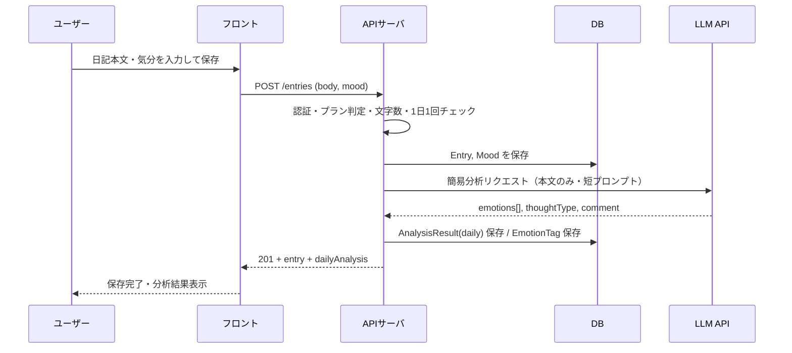
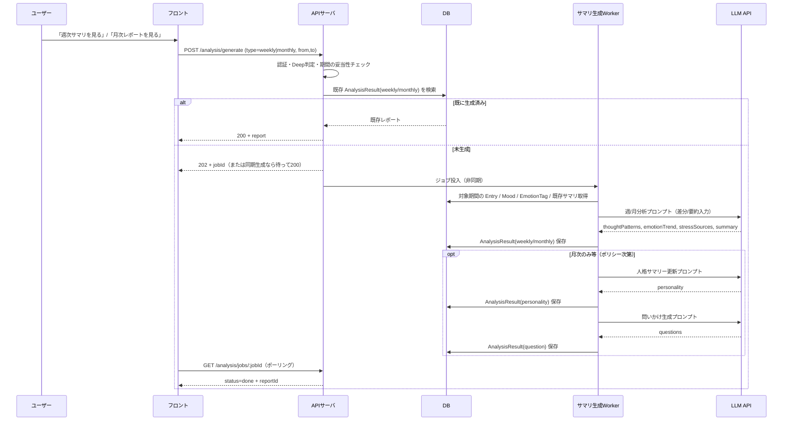
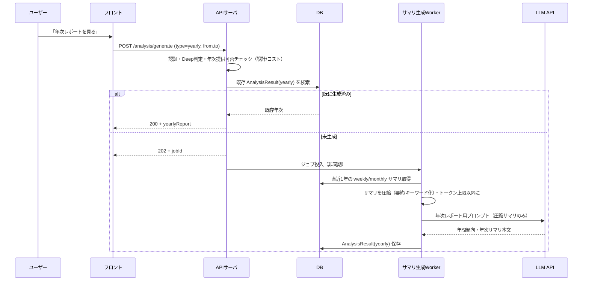
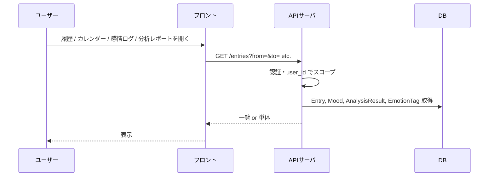

# Reflect 詳細設計書

basic-design.md を前提に、実装に必要な詳細を定義する。  
**技術選定を先に確定したうえで**、シーケンス・コンポーネント・API・プロンプト・DB を決める。技術選定が後ろだとコンポーネント構成・API・DB の書き方がぶれるため、まずスタックを固める。

---

## 1. 技術選定

詳細設計・実装の**前に**決めておくこと。選定結果に応じてシーケンス・API・DB の具体（Supabase の有無、Edge にするか別サーバにするか等）が変わる。

### 1.1 選定項目と候補

| 領域 | 選定項目 | 候補・メモ |
|------|----------|------------|
| **認証** | プロバイダ | **メール + Google** のみ（推奨: Supabase Auth でメール＋Google をまとめる） |
| **フロント** | フレームワーク | React, Next.js（SSR/SSG の要否で判断）, Vite + React 等 |
| **API** | 実行基盤 | Supabase Edge Functions / Node (Express/Fastify) 等の常駐サーバ |
| **DB** | ストア | Supabase (PostgreSQL) / 他 RDB。RLS でマルチテナントを強制しやすいのは Supabase。 |
| **LLM** | プロバイダ・モデル | OpenAI (GPT-4o-mini 等で軽量、必要時だけ GPT-4) / Claude 等。コスト・レイテンシで選択。 |
| **サマリ生成（重い処理）** | 実行方式 | **ユーザー操作起点**（サマリを見るボタン等）で Worker を起動。必要なら非同期ジョブ化（キュー） |
| **キュー（任意）** | 非同期ジョブ | 簡易分析を非同期にする場合: Redis / SQS / Supabase + ポーリング 等 |
| **課金** | 決済 | Stripe サブスク / 他。subscriptions テーブルと webhook で連携。 |

### 1.2 推奨の組み合わせ（参照）

- **フロント**: React / Next。認証は Supabase Auth なら SDK でトークン管理。
- **API**: Supabase Edge Functions（認証・日記CRUD・分析トリガー） or Node 常駐サーバ。JWT 検証 or RLS と組み合わせ。
- **DB**: Supabase (PostgreSQL)。RLS で `user_id = auth.uid()` を強制。
- **LLM**: OpenAI API。軽いタスクは gpt-4o-mini、重い分析は gpt-4o 等で切り替え。max_tokens でコスト制御。
- **サマリ生成**: 週/月/年は操作起点で生成し、生成済みはキャッシュして再利用（必要なら手動再生成）。

### 1.3 選定時の確認事項

- 認証を Supabase に寄せるか、別 IdP にするか → API・フロントのトークン扱いが変わる。
- API を Edge のみにするか、常駐サーバを立てるか → **重いサマリ生成（操作起点）**をどこで動かすか・キューを使うかが変わる。
- 簡易分析を同期にするか非同期にするか → キュー・ポーリング/WebSocket の要否が変わる。

選定結果はここに「決定: 〇〇」とメモしておくと、後のシーケンス・コンポーネント・DB と齟齬しにくい。

---

## 2. シーケンス

### 2.1 日記保存 ＋ 簡易分析（Free）

日記保存時に同期 or 非同期で簡易分析を実行する流れ。



- **同期案**: 上記のまま。レイテンシ数十秒を許容する場合はこの形でよい。
- **非同期案**: API は Entry 保存後に 202 を返し、バックグラウンドで分析。フロントはポーリング or WebSocket で結果取得。コスト平準化・タイムアウト回避に有利。

---

### 2.2 週次・月次サマリ生成（Deep・操作起点）

重い処理（週次/月次の深層分析・人格サマリー更新・問いかけ生成）は、**ユーザーの操作起点**（例: 「週次サマリを見る」ボタン）で実行する。生成済みのサマリは DB に保存し、**同じ期間はキャッシュを返す**（再生成は明示操作のみ）。



- 「jobId」を持たないシンプル実装にする場合は、POST を同期実行して 200 を返す（ただしタイムアウトしやすい）。\n+- 非同期にする場合、`analysis_jobs` のようなジョブ管理（状態: queued/running/done/failed）を用意するのが安全。

---

### 2.3 年次レポート生成（Deep・条件付き / 操作起点）

年次も**操作起点**（例: 「年次レポートを見る」）で生成する。入力はトークン節約のため、**週/月サマリの圧縮版のみ**（生日記なし）。



- PDF 生成は「保存済みの年次 payload からオンデマンド生成」でもよい（別ジョブ化も可）。

---

### 2.4 履歴・感情ログ・レポート取得



- 取得系はすべて **認証済み user_id でフィルタ**。他ユーザーデータは返さない。

---

## 3. コンポーネント

### 3.1 全体構成

```
┌─────────────────────────────────────────────────────────────────┐
│  フロント（Web）                                                  │
│  - 日記入力 / 気分選択 / 履歴・カレンダー / 感情ログ / 分析レポート  │
└───────────────────────────┬─────────────────────────────────────┘
                             │ HTTPS
┌────────────────────────────▼─────────────────────────────────────┐
│  API サーバ（BFF）                                                │
│  - 認証・認可  - 日記CRUD  - 分析トリガー  - レポート配信          │
└──────┬──────────────────────────────┬────────────────────────────┘
       │                              │
       ▼                              ▼
┌──────────────┐              ┌──────────────────┐
│  DB          │              │  LLM API         │
│  (RDB or     │              │  (OpenAI / 他)   │
│   Supabase等) │              │  - 簡易分析       │
└──────────────┘              │  - 週/月/年分析   │
       │                      │  - 人格サマリー   │
       │                      │  - 問いかけ      │
       ▼                      └──────────────────┘
┌──────────────┐
│  キュー/     │   ※ 非同期分析にする場合
│  ジョブ      │
└──────────────┘
```

### 3.2 コンポーネント一覧と責務

| コンポーネント | 責務 | 備考 |
|----------------|------|------|
| **フロント** | 画面・入力・一覧・グラフ表示。API 呼び出し。認証状態の扱い。 | SPA/SSR は選定次第。感情グラフは Deep でグラフライブラリ利用想定。 |
| **API サーバ** | 認証検証、リクエスト検証、日記CRUD、分析生成のトリガー、分析結果の取得・配信。プラン（Free/Deep）に応じた制限（文字数・回数・取得範囲）。 | レート制限・トークン制限の実施主体。 |
| **DB** | User, Entry, Mood, AnalysisResult, EmotionTag, Subscription の永続化。トランザクションで日記＋気分＋分析を一貫して保存。 | マルチテナントは必ず user_id で分離。 |
| **LLM API** | プロンプトに従い、簡易分析・週/月/年分析・人格サマリー・問いかけのテキストを返す。 | モデル切り替え（軽量/高能力）は API 層 or Worker で制御。 |
| **サマリ生成Worker** | **ユーザー操作起点**で週/月/年サマリを生成。DB から入力取得 → LLM 呼び出し → 結果を DB に保存。 | 非同期ジョブとして動かすのが安全（タイムアウト回避）。 |
| **キュー（任意）** | 日記保存時の簡易分析を非同期にする場合に使用。ジョブの投入・再試行。 | Redis / SQS / Supabase Edge 等。 |

- 技術選定の詳細と決定メモは **第1章（技術選定）** を参照。

---

## 4. API

### 4.1 共通

- **ベースURL**: `/api/v1`（例）
- **認証**: Bearer JWT（Supabase Auth の access_token 等）。未認証は 401。
- **レスポンス**: JSON。エラーは `{ "error": "code", "message": "..." }` 形式を推奨。
- **プランによる制限**: Free は 1日1投稿・文字数上限・7日分履歴等。API 側で検証し 403 or 400 で返す。

### 4.2 エンドポイント一覧

| メソッド | パス | 説明 | 備考 |
|----------|------|------|------|
| POST | /auth/refresh | トークン更新 | 必要に応じて |
| GET | /me | 自分（ユーザー・プラン） | 認証必須 |
| POST | /entries | 日記を1件作成 | body: `{ "body": "...", "mood": "..." }`。Free は 1日1回・文字数制限 |
| GET | /entries | 日記一覧（期間指定） | query: `from`, `to` (日付)。Free は直近7日まで |
| GET | /entries/:id | 日記1件 | 自ユーザーのみ |
| PATCH | /entries/:id | 日記1件更新 | 任意で提供。自ユーザーのみ |
| DELETE | /entries/:id | 日記1件削除 | 自ユーザーのみ |
| GET | /entries/:id/analysis | 指定日記の簡易分析（daily） | 自ユーザーのみ |
| GET | /analysis | 分析結果一覧 | query: `type=daily|weekly|monthly|personality|yearly|question`, `from`, `to` |
| POST | /analysis/generate | 週/月/年サマリを生成（操作起点） | body: `{ \"type\": \"weekly|monthly|yearly\", \"from\": \"YYYY-MM-DD\", \"to\": \"YYYY-MM-DD\" }`。Deep のみ |
| GET | /analysis/jobs/:jobId | 生成ジョブ状態 | 非同期の場合のみ（queued/running/done/failed） |
| GET | /analysis/summary | 人格サマリー最新1件 | Deep。type=personality の最新で代替可 |
| GET | /emotions | 感情ログ（日付・タグ） | query: `from`, `to`。時系列で返す |
| GET | /calendar | 投稿日一覧（カレンダー用） | query: `from`, `to`。日付の配列 or マーク用 |
| GET | /subscription | サブスク状態 | Deep 解約等に利用 |

### 4.3 リクエスト・レスポンス例

#### POST /entries

**Request**

```json
{
  "body": "今日は〇〇で...",
  "mood": "neutral"
}
```

**Response (201)**

```json
{
  "id": "uuid",
  "userId": "uuid",
  "body": "今日は〇〇で...",
  "wordCount": 120,
  "postedAt": "2025-02-11",
  "createdAt": "2025-02-11T12:00:00Z",
  "mood": "neutral",
  "dailyAnalysis": {
    "emotions": ["不安", "焦り", "期待"],
    "thoughtType": "不安傾向",
    "comment": "〇〇についての言及が目立つ。先週の日記でも同様のパターンがあった。"
  }
}
```

- 非同期で簡易分析を行う場合は `dailyAnalysis` を null にして返し、別途 GET /entries/:id/analysis で取得。

#### GET /analysis?type=monthly&from=2025-01-01&to=2025-01-31

**Response (200)**

```json
{
  "userId": "uuid",
  "type": "monthly",
  "period": { "from": "2025-01-01", "to": "2025-01-31" },
  "payload": {
    "thoughtPatterns": ["認知の癖", "ネガティブループ..."],
    "emotionTrend": "週ごとの集計データ or 要約",
    "stressSources": ["〇〇", "△△"],
    "summary": "1月の振り返り短文"
  },
  "createdAt": "2025-02-01T03:00:00Z"
}
```

#### GET /analysis/summary（人格サマリー）

**Response (200)**

```json
{
  "tendency": "あなたの傾向まとめテキスト",
  "strengths": ["強み1", "強み2"],
  "weaknesses": ["弱み1"],
  "downTriggers": "落ち込みやすい条件の説明",
  "recoveryActions": "回復しやすい行動の説明",
  "updatedAt": "2025-02-01T03:00:00Z"
}
```

### 4.4 エラー・制限

- **400**: バリデーション（文字数超過、mood 不正等）
- **403**: プラン制限（例: Free で8日目以降の履歴取得、Deep 限定エンドポイント）
- **404**: 指定 id が存在しない or 他ユーザー
- **429**: レート制限（1日1回超過等）

---

## 5. プロンプト

### 5.1 共通ルール（全プロンプトで守る）

- **禁止**: 占い・スピリチュアル・ポエム・ふわっとした励ましのみの文。
- **必須**: 傾向・パターン・「先週も出てた」のような**具体的で冷静な分析**。必要なら短く刺さる一言。
- **出力形式**: 指定した JSON またはマークダウンで返す。余計な前置きは最小限に。
- **言語**: 日本語で出力。

### 5.2 簡易分析（Free・daily）

- **入力**: その日の日記本文のみ（最大 500〜800 字を想定）。
- **出力**: 感情タグ 3語、思考タイプ 1つ、一言コメント 1文。
- **トークン**: 出力は極力短く。1日 1,000 トークン以下を目標。

**システムプロンプト（要約）**

```
あなたはユーザーの日記を分析するアシスタントです。
出力は「傾向」と「パターン」に基づく冷静な分析に限定し、占い・スピリチュアル・ポエム・曖昧な励ましは禁止です。
「このパターンは先週も見られた」「〇〇について言及が多く、不安傾向と一致する」のように、根拠が分かる短いコメントを1文で返してください。
```

**ユーザープロンプト例**

```
以下の日記から、次の3つだけを抽出し、指定のJSON形式で返してください。

1. emotions: 日記から読み取れる感情を3語まで（例: 不安, 焦り, 期待）。辞書: 不安, 怒り, 喜び, 焦り, 悲しみ, 期待, 感謝, 後悔, 罪悪感, 無力感 から選ぶか、それに近い語で。
2. thoughtType: 思考の傾向を1つ（例: 不安傾向, 他責傾向, 完璧主義傾向, 自己否定傾向, 回避傾向）。複数あれば最も強い1つ。
3. comment: 上記のルールに従った、1文の分析コメント（50字程度）。

日記:
---
{日記本文}
---
出力は次のJSONのみ。説明は不要。
{"emotions":["","",""],"thoughtType":"","comment":""}
```

### 5.3 週次・月次分析（Deep）

- **入力**: 対象期間の日記要約 or 差分（前回からの追加分）＋既存の週/月サマリ（あれば）。トークン上限内に収める。
- **出力**: 思考パターン、感情推移の要約、ストレス源ランキング、短文サマリー。構造は API の payload に合わせて JSON 指定。

**方針**

- システムプロンプトで「占い・ポエム禁止・傾向とパターンで論じる」を再度明記。
- 出力スキーマを JSON で固定し、長文にならないよう max_tokens を設定。

**ユーザープロンプト例（骨子）**

```
対象期間: {from} 〜 {to}

【入力データ】
（ここに期間内の日記の要約、または日付ごとの感情タグ・一言要約の一覧を渡す。生日記全文は渡さない）

上記から以下を JSON で出力してください。
- thoughtPatterns: 認知の癖・ネガティブループ・行動トリガーを短文で配列（3〜5件）
- emotionTrend: 感情の推移を2〜3文で要約
- stressSources: ストレス源と思われるキーワード or 短文をランキング形式で配列（最大5件）
- summary: 期間の振り返りを2〜3文で

{"thoughtPatterns":[],"emotionTrend":"","stressSources":[],"summary":""}
```

### 5.4 人格サマリー（Deep）

- **入力**: 直近 N 日分の週/月サマリの要約、または既存の人格サマリー＋直近の差分。生日記は渡さない。
- **出力**: 傾向まとめ、強み、弱み、落ち込みやすい条件、回復しやすい行動。固定フォーマットで JSON。

**ユーザープロンプト例（骨子）**

```
これまでの分析サマリを要約したデータです。ここから「その人の取扱説明書」として、次の5項目を JSON で出力してください。
占い・スピリチュアル・ポエムは禁止。傾向とパターンに基づく冷静な記述に限定すること。

- tendency: その人の傾向のまとめ（3〜5文）
- strengths: 強みを短文で配列（3件程度）
- weaknesses: 弱みを短文で配列（2〜3件）
- downTriggers: 落ち込みやすい条件の説明（2〜4文）
- recoveryActions: 回復しやすい行動の説明（2〜4文）

【入力】
{週/月サマリの要約 or 圧縮版}

出力は JSON のみ。
{"tendency":"","strengths":[],"weaknesses":[],"downTriggers":"","recoveryActions":""}
```

### 5.5 年次レポート（Deep・条件付き）

- **入力**: 直近1年分の**週/月サマリの圧縮版**のみ。日記本文は一切渡さない。
- **出力**: 年間の傾向まとめ、感情推移の年間要約、年間サマリ本文。PDF 用の章立てを想定した構造でも可。

**ユーザープロンプト例（骨子）**

```
以下は、あるユーザーの直近1年分の「週次・月次分析サマリ」を圧縮したデータです。
日記の生テキストは含まれていません。このデータのみを元に、年間レポート用のサマリを生成してください。
占い・ポエム禁止。傾向とパターンのみで、冷静に記述すること。

【入力】
{週/月サマリの圧縮版を時系列で連結}

出力:
- yearSummary: 1年を振り返る傾向のまとめ（4〜6文）
- emotionYearTrend: 感情の年間推移の要約（2〜3文）
- sections: レポート用の章ごと短文（例: 傾向, 強み/弱み, 落ち込み・回復 等）

JSON で返す。
```

### 5.6 問いかけモード（Deep）

- **入力**: 直近の感情タグ・思考タイプの傾向、または週/月サマリの要約。
- **出力**: 「最近〇〇が多いけど、なぜだと思う？」形式の質問文 1〜3 件。カウンセラー的だが誘導しすぎないように。

**ユーザープロンプト例（骨子）**

```
以下の分析結果に基づき、ユーザーに投げかける「問いかけ」を1〜3文で生成してください。
押し付けや誘導ではなく、気づきを促す質問にすること。占い・ポエム禁止。

【入力】
{感情タグの傾向 or 短文サマリ}

出力は質問文のみ。配列で返す。
["質問1", "質問2"]
```

### 5.7 感情タグ・思考タイプの辞書（参照）

- **感情タグ（EmotionTag）**: 不安, 怒り, 喜び, 焦り, 悲しみ, 期待, 感謝, 後悔, 罪悪感, 無力感 を基本とし、プロンプト内で「これに近い語」を許可してもよい。
- **思考タイプ（Free 用）**: 不安傾向, 他責傾向, 完璧主義傾向, 自己否定傾向, 回避傾向 等を列挙し、いずれか1つを選ばせる。

---

## 6. DB

### 6.1 スキーマ概要

- RDB を想定（PostgreSQL / Supabase）。マルチテナントは全テーブルで `user_id` を必須とし、RLS でスコープする。

### 6.2 テーブル定義

#### users

| カラム | 型 | 説明 |
|--------|-----|------|
| id | UUID PK | ユーザーID（auth.users と 1:1 想定） |
| email | TEXT | メール（任意） |
| plan | TEXT | 'free' \| 'deep' |
| created_at | TIMESTAMPTZ | |
| updated_at | TIMESTAMPTZ | |

#### entries

| カラム | 型 | 説明 |
|--------|-----|------|
| id | UUID PK | |
| user_id | UUID FK(users) NOT NULL | |
| body | TEXT NOT NULL | 日記本文 |
| word_count | INT | 文字数（検証用） |
| posted_at | DATE NOT NULL | 投稿日（1日1回制限のキー） |
| created_at | TIMESTAMPTZ | |

- **ユニーク**: (user_id, posted_at)。Deep で 1日複数可にする場合はこの制約を外すか、別テーブルで「日付単位の投稿回数」を管理。

#### moods

| カラム | 型 | 説明 |
|--------|-----|------|
| id | UUID PK | |
| user_id | UUID FK(users) NOT NULL | |
| entry_id | UUID FK(entries) NULL | 日記に紐づく場合 |
| value | TEXT NOT NULL | 例: happy, neutral, down, anxious |
| recorded_at | DATE NOT NULL | 日付 |
| created_at | TIMESTAMPTZ | |

#### analysis_results

| カラム | 型 | 説明 |
|--------|-----|------|
| id | UUID PK | |
| user_id | UUID FK(users) NOT NULL | |
| type | TEXT NOT NULL | daily \| weekly \| monthly \| yearly \| personality \| question |
| period_from | DATE | 対象期間開始（daily の場合は posted_at と一致させる等） |
| period_to | DATE | 対象期間終了 |
| payload | JSONB NOT NULL | 分析結果の本体（プロンプトで定義した構造） |
| created_at | TIMESTAMPTZ | |

- **インデックス**: (user_id, type, period_from), (user_id, type, created_at DESC)。年次は type=yearly で取得。

#### analysis_jobs（任意 / 非同期生成する場合）

`POST /analysis/generate` を非同期で返す場合のジョブ管理。同期実装なら不要。

| カラム | 型 | 説明 |
|--------|-----|------|
| id | UUID PK | jobId |
| user_id | UUID FK(users) NOT NULL | |
| type | TEXT NOT NULL | weekly \| monthly \| yearly |
| period_from | DATE NOT NULL | |
| period_to | DATE NOT NULL | |
| status | TEXT NOT NULL | queued \| running \| done \| failed |
| result_analysis_id | UUID FK(analysis_results) NULL | done の場合に紐づけ |
| error_message | TEXT NULL | failed の場合 |
| created_at | TIMESTAMPTZ | |
| updated_at | TIMESTAMPTZ | |

- **ユニーク（推奨）**: (user_id, type, period_from, period_to, status in queued/running) で二重起動を防止（実装で近似でも可）。

#### emotion_tags

| カラム | 型 | 説明 |
|--------|-----|------|
| id | UUID PK | |
| user_id | UUID FK(users) NOT NULL | |
| entry_id | UUID FK(entries) NOT NULL | |
| tag | TEXT NOT NULL | 辞書に従った感情タグ |
| created_at | TIMESTAMPTZ | |

- **インデックス**: (user_id, entry_id), (user_id, created_at)。感情ログの時系列取得用。

##### 気分（moods）と感情ログ（emotion_tags）の違い

- **moods**: ユーザー自己申告の単一値（「今の気分」）。入力が速く、習慣化に効く。
- **emotion_tags**: 日記本文から AI が推定する複数タグ（「文章に現れた感情」）。推移・傾向分析に向く。

**区別するメリット（推奨）**

- 自己申告と文章のズレが洞察になる（例: 気分は neutral だが不安タグが多い）。

**統合する場合**

- 実装簡略化を優先するなら、`affect_events` のような単一テーブルに寄せて `source=user|ai` を持たせる（本書は分離前提）。

#### subscriptions

| カラム | 型 | 説明 |
|--------|-----|------|
| id | UUID PK | |
| user_id | UUID FK(users) UNIQUE NOT NULL | |
| plan | TEXT NOT NULL | 'deep' |
| status | TEXT | active \| canceled \| past_due 等 |
| current_period_end | TIMESTAMPTZ | 課金基盤に依存 |
| created_at | TIMESTAMPTZ | |
| updated_at | TIMESTAMPTZ | |

- 決済基盤（Stripe 等）の webhook で更新する想定。

### 6.3 インデックス一覧（推奨）

| テーブル | インデックス | 用途 |
|----------|--------------|------|
| entries | (user_id, posted_at) | 日付範囲検索・1日1回チェック |
| entries | (user_id, created_at DESC) | 履歴一覧 |
| analysis_results | (user_id, type, period_from) | 期間指定取得 |
| analysis_results | (user_id, type, created_at DESC) | 最新の人格サマリー・問いかけ取得 |
| emotion_tags | (user_id, created_at) | 感情ログ時系列 |

### 6.4 RLS（Supabase の場合）

- 全テーブルで `user_id = auth.uid()` を条件にしたポリシーのみ許可。
- `users` は自レコードのみ読み書き可能とする。

---

## 7. ドキュメントの関係

- **concept.md / design.md**: 製品コンセプト・機能方針
- **basic-design.md**: 機能要件・非機能・データモデル概念・画面フロー
- **detailed-design.md（本書）**: 技術選定 → シーケンス・コンポーネント・API・プロンプト・DB の実装レベル詳細

実装時は**技術選定を確定してから**本書の 2 章以降を基準にし、スキーマ変更・API 追加・プロンプト改良を逐次反映する。
